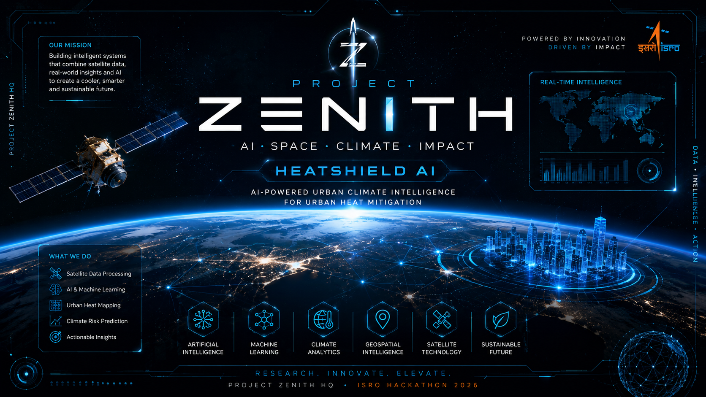

<p align="center"> 
    
</p> 

<div align="center">  

# 🚀 PROJECT ZENITH


---
 
### 🌍 Building the Future with AI, Climate Intelligence & Space \Technology


</div>

---

# 🛰️ Current Mission

## HeatShield AI

AI-powered Urban Climate Intelligence Platform for detecting urban heat islands, predicting future heat-risk zones, and recommending mitigation strategies using:

- Satellite Imagery
- Geospatial Analytics
- Machine Learning
- Climate Intelligence
- Environmental Data Science

---

# 🎯 Core Focus Areas

<table>
<tr>
<td width="50%">

### 🤖 Artificial Intelligence

- Deep Learning
- Computer Vision
- Predictive Analytics
- Decision Intelligence

</td>

<td width="50%">

### 🌍 Climate Intelligence

- Urban Heat Mapping
- Climate Risk Analysis
- Sustainability Planning
- Environmental Monitoring

</td>
</tr>
</table>

---

# ⚡ Active Repository

### HeatShield AI

Urban Heat Mitigation via AI/ML

Current Phase:

```text
[████████░░░░░░░░░░] 40%
Planning & Architecture
```

---

# 🏗️ Project Structure

```text
heatshield-ai/
│
├── backend/
├── frontend/
├── models/
├── datasets/
├── notebooks/
├── src/
├── docs/
│
└── README.md
```

---

# 🚀 Project Zenith Mission

> Building innovative AI solutions for real-world environmental challenges through research, engineering, collaboration, and scientific excellence.

---

# 🌟 Vision

Project Zenith aims to develop next-generation AI systems capable of transforming environmental decision-making through geospatial intelligence, climate analytics, and satellite data processing.

---

<div align="center">

### ⚡ PROJECT ZENITH HQ ⚡

"Research. Innovate. Elevate."

</div>
