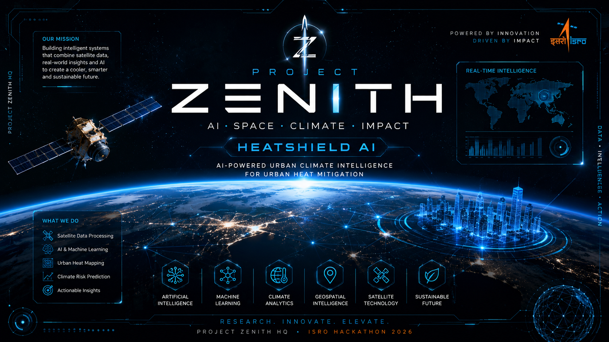

<div align="center">

<!-- PLACEHOLDER: Replace ../assets/banner.png with the actual ASTRA-X banner image path once uploaded to the .github repository's assets folder. -->


<br />

# ASTRA-X

### IDEAS BEYOND LIMITS

**BUILD • INNOVATE • IMPACT**

<br />

<!-- PLACEHOLDER: Typing SVG generated via readme-typing-svg.demolab.com — verify rendering after publishing. -->
<a href="https://github.com/ASTRA-X">
  
</a>

<br /><br />

<!-- PLACEHOLDER: Replace ASTRA-X with the exact GitHub organization username if different. -->
<a href="https://github.com/ASTRA-X">
  
</a>
<a href="https://www.sih.gov.in/">
  
</a>


</div>

<br />

---

## ORGANIZATION STATUS

<div align="center">

| | |
|---|---|
| **TEAM** | ASTRA-X |
| **MISSION** | Smart India Hackathon 2026 |
| **ACTIVE PROBLEM STATEMENT** | SIH26092 |
| **DOMAIN** | Artificial Intelligence • Financial Intelligence • Decision Support |
| **TEAM SIZE** | 6 Engineers |
| **STATUS** | ACTIVE DEVELOPMENT |

</div>

---

## CURRENT MISSION

### SIH26092 — AI-Driven Scheme Matching for Marginalized Entrepreneurs

India runs a wide network of government financial assistance programs, concessional loan schemes, and subsidy initiatives intended to support marginalized entrepreneurs. In practice, however, this ecosystem is fragmented and difficult to navigate. Entrepreneurs typically struggle to determine:

- Which scheme is relevant to their specific situation
- Whether they actually qualify under the eligibility criteria
- How much financial assistance they may be entitled to
- What a realistic repayment structure would look like
- Which documents are required for a given scheme
- Where and how to apply
- Which channel partner or lending institution is appropriate for them

The result is a persistent gap between the schemes that exist and the entrepreneurs who could benefit from them.

**ASTRA-X is building an intelligent platform to close this gap** — a system that understands an entrepreneur's profile, filters and ranks relevant schemes, explains *why* each recommendation was made, and guides the user from discovery through to application.

---

## SYSTEM VISION

<div align="center">

```
                         USER PROFILE
                              │
                              ▼
                   PROFILE UNDERSTANDING
                              │
                              ▼
                   ELIGIBILITY ENGINE
                              │
                              ▼
                   SCHEME INTELLIGENCE
                              │
                              ▼
                 AI MATCHING & RANKING
                              │
                              ▼
              EXPLAINABLE RECOMMENDATION
                              │
                              ▼
                   FINANCIAL ANALYSIS
                              │
                              ▼
                  DOCUMENT GUIDANCE
                              │
                              ▼
            CHANNEL PARTNER DISCOVERY
                              │
                              ▼
                APPLICATION ASSISTANCE
```

</div>

---

## THE INTELLIGENCE LAYER

AI is not being used here as a decorative chatbot bolted onto a form. It is a structural layer of the system, combining deterministic logic with machine intelligence where each is best suited:

- **Rule-based eligibility verification** — hard constraints (income, category, region, sector) are enforced deterministically, not left to model inference
- **AI-powered scheme matching** — semantic matching between user profile and scheme corpus
- **Ranking algorithms** — ordering eligible schemes by relevance and benefit
- **Natural Language Processing** — parsing unstructured profile and document inputs
- **Retrieval-Augmented Generation (where appropriate)** — grounding conversational answers in verified scheme documents rather than free generation
- **Explainable recommendations** — every ranked scheme is accompanied by a reason
- **Financial calculations** — deterministic EMI and repayment modeling, not AI-estimated
- **Profile intelligence** — structured extraction of entrepreneur attributes
- **Conversational assistance** — guided Q&A layered on top of verified data

**Conceptual pipeline:**

```
USER DATA
   → FEATURE EXTRACTION
   → ELIGIBILITY FILTERING
   → SCHEME MATCHING
   → SCORING
   → RANKING
   → EXPLANATION
   → RECOMMENDATION
```

> Deterministic eligibility rules are never blindly delegated to an LLM. Eligibility is a compliance-sensitive decision and is handled by verifiable logic; the AI layer operates on top of — not in place of — that logic.

---

## CORE PLATFORM MODULES

| # | Module | Description |
|---|--------|-------------|
| 01 | **User Profiling Engine** | Captures and structures entrepreneur profile data |
| 02 | **Scheme Knowledge Base** | Curated, structured repository of government schemes |
| 03 | **Eligibility Engine** | Deterministic rule evaluation against scheme criteria |
| 04 | **AI Scheme Matching Engine** | Semantic matching of profiles to eligible schemes |
| 05 | **Explainable Recommendation Engine** | Generates human-readable reasoning for each match |
| 06 | **Financial Calculator** | Computes EMI, repayment schedules, and financial outcomes |
| 07 | **Document Requirement Engine** | Maps required documents per scheme and user type |
| 08 | **Channel Partner Locator** | Identifies suitable lending institutions / partners |
| 09 | **AI Assistance Layer** | Conversational, RAG-grounded guided assistance |
| 10 | **Application Guidance** | Step-by-step walkthrough of the application process |
| 11 | **Admin / Scheme Management Dashboard** | Internal tooling to maintain the scheme knowledge base |
| 12 | **Analytics & Impact Dashboard** | Tracks platform usage and outcome metrics |

---

## TECH STACK

<div align="center">

**Frontend**


**Backend**


**AI / ML**


**Database**


**Infrastructure**


</div>

| Layer | Technology | Status |
|---|---|---|
| Frontend | React / Next.js, TypeScript, Tailwind CSS | Planned |
| Backend | Python, FastAPI, REST APIs | Planned |
| AI / ML Core | Python, Scikit-learn | Planned |
| Deep Learning (where applicable) | PyTorch | Under Evaluation |
| NLP / Embeddings | Embedding models, ranking models | Planned |
| AI Assistant | LLM, RAG, Vector Database | Under Evaluation |
| Database | PostgreSQL | Planned |
| Maps / Location | OpenStreetMap / Leaflet | Under Evaluation |
| Infrastructure | Docker, GitHub Actions | Planned |
| Cloud Deployment | TBD | Planned |

> Technologies listed as **Planned** or **Under Evaluation** have not yet been implemented. This stack reflects the current architectural direction, not a claim of completed integration.

---

## REPOSITORY ARCHITECTURE

```
astra-x-sih26092/
│
├── frontend/          # React / Next.js client application
├── backend/           # FastAPI services and REST APIs
├── ai-engine/         # Matching, ranking, and NLP components
├── data/              # Raw and processed scheme datasets
├── models/            # Trained model artifacts
├── notebooks/         # Research and experimentation notebooks
├── database/          # Schema, migrations, seed data
├── docs/              # Architecture, API, AI, research documentation
├── tests/             # Unit and integration tests
├── deployment/         # Docker, CI/CD, environment configuration
├── assets/            # Branding, diagrams, media
│
├── README.md
├── LICENSE
├── CONTRIBUTING.md
└── .gitignore
```

| Directory | Purpose |
|---|---|
| `frontend/` | User-facing web application |
| `backend/` | API layer connecting frontend to the AI engine and database |
| `ai-engine/` | Eligibility filtering, matching, ranking, and NLP logic |
| `data/` | Scheme knowledge base and supporting datasets |
| `models/` | Serialized ranking / matching model artifacts |
| `notebooks/` | Exploratory research and model development |
| `database/` | PostgreSQL schema and migration scripts |
| `docs/` | All project documentation |
| `tests/` | Automated test suites |
| `deployment/` | Containerization and deployment configuration |
| `assets/` | README media, diagrams, and brand assets |

---

## DEVELOPMENT ROADMAP

| Phase | Focus | Status |
|---|---|---|
| 01 | Research & Problem Understanding | IN PROGRESS |
| 02 | Government Scheme Dataset / Knowledge Base | PLANNED |
| 03 | Eligibility Engine | PLANNED |
| 04 | AI Matching & Ranking | PLANNED |
| 05 | Financial Intelligence | PLANNED |
| 06 | Partner Locator | PLANNED |
| 07 | AI Assistant / RAG | PLANNED |
| 08 | Frontend + Backend Integration | PLANNED |
| 09 | Testing & Validation | PLANNED |
| 10 | SIH Demo & Final Optimization | PLANNED |

---

## TEAM ARCHITECTURE

ASTRA-X is organized as six specialized engineering roles rather than an undifferentiated group project:

| Role | Responsibility |
|---|---|
| **Frontend Engineer** | Builds the user-facing application and interaction flows |
| **Backend Engineer** | Owns APIs, service architecture, and data flow |
| **AI/ML Engineer** | Designs the matching, ranking, and scoring logic |
| **Research & Data Engineer** | Sources, structures, and validates the scheme knowledge base |
| **UI/UX Designer** | Owns interface design and user experience |
| **Product / Presentation / Documentation Lead** | Owns problem framing, documentation, and demo narrative |

These roles operate as an integrated pipeline: research and data work feed the eligibility and AI engines, which are exposed through backend APIs, consumed by the frontend, and packaged for presentation by the product and documentation lead — mirroring how a small applied-AI engineering team would structure itself in production.

---

## ENGINEERING PRINCIPLES

- Evidence over assumptions
- Explainable AI
- Privacy-aware design
- Reliable eligibility logic
- Reproducible research
- Modular architecture
- API-first development
- Test before deployment
- User-centric design
- Real-world impact

---

## WHY ASTRA-X

We do not build technology to demonstrate technology. We build systems engineered to solve problems that matter — where the measure of success is not a working demo, but whether the system would actually help the people it was designed for.

SIH26092 is not treated as a hackathon exercise to be completed and forgotten. It is approached as a real product problem: a fragmented, high-friction information space that stands between entrepreneurs and the support they are entitled to. ASTRA-X exists to engineer that gap away — deliberately, rigorously, and with the discipline of a team building for production, not just for a judging panel.

---

## IMPACT

| Dimension | Description |
|---|---|
| **Social Impact** | Helps entrepreneurs discover relevant government financial opportunities |
| **Financial Literacy** | Makes complex financial schemes easier to understand |
| **Accessibility** | Reduces the information gap between government schemes and potential beneficiaries |
| **Efficiency** | Reduces time spent searching through numerous schemes |
| **Transparency** | Explains why a scheme was recommended |
| **Scalability** | Architecture designed so the knowledge base can expand to additional schemes and regions |

---

## SECURITY & RESPONSIBLE AI

- Protection of user information throughout the profile and matching pipeline
- Minimal data collection — only what is required for eligibility and matching
- Secure API design across all backend services
- Authentication enforced wherever user-specific data is handled
- No fabricated eligibility claims — outputs are grounded in verified scheme rules
- Clear distinction maintained between verified deterministic rules and AI-generated explanations
- Human verification recommended for critical financial decisions before final action is taken

---

## DEMO FLOW

1. User enters their profile
2. System analyzes the profile
3. Eligibility engine filters applicable schemes
4. AI ranking engine ranks suitable schemes
5. System explains the reasoning behind each recommendation
6. User selects a scheme
7. Financial calculator estimates repayment (EMI and related figures)
8. System displays required documents
9. System identifies suitable channel partners
10. AI assistant answers follow-up questions

---

## RESEARCH & VALIDATION

| Area | Status |
|---|---|
| Dataset sources | `TBD — Evaluation in progress` |
| Government scheme sources | `TBD — Evaluation in progress` |
| Model evaluation | `TBD — Evaluation in progress` |
| Recommendation accuracy | `TBD — Evaluation in progress` |
| Eligibility accuracy | `TBD — Evaluation in progress` |
| Response latency | `TBD — Evaluation in progress` |
| System performance | `TBD — Evaluation in progress` |
| User testing | `TBD — Evaluation in progress` |

---

## PROJECT STATUS

<div align="center">

**ASTRA-X — SIH 2026 — SIH26092**

*Illustrative current development status. No component below is claimed as complete unless explicitly marked so.*

```
Research         ███████░░░
Architecture     █████░░░░░
Development      ███░░░░░░░
AI Engine        ██░░░░░░░░
Testing          ░░░░░░░░░░
Deployment       ░░░░░░░░░░
```

**Deployment:** Planned

</div>

---

## EXPLORE ASTRA-X

<!-- PLACEHOLDER:
Replace SIH26092 with <ACTUAL_REPOSITORY_NAME> if the project repository is named differently.
Do NOT invent a different repository name.
-->

| Resource | Link |
|---|---|
| Organization | [ASTRA-X](https://github.com/ASTRA-X) |
| SIH 2026 Project | [SIH26092](https://github.com/ASTRA-X/SIH26092) |
| Documentation | [Documentation](https://github.com/ASTRA-X/SIH26092/tree/main/docs) |
| Issues | [Issues](https://github.com/ASTRA-X/SIH26092/issues) |
| Discussions | [Discussions](https://github.com/ASTRA-X/SIH26092/discussions) |
| Project Board | [Project Board](https://github.com/ASTRA-X/SIH26092/projects) |

<!-- PLACEHOLDER:
Replace the repository name below once the SIH repository is created.
Current planned repository:
https://github.com/ASTRA-X/SIH26092
-->

[View Project Repository](https://github.com/ASTRA-X/SIH26092)

[](#)
<!-- PLACEHOLDER: Replace # with the actual YouTube / Drive / video URL once the demo video is uploaded. -->

---

## DOCUMENTATION

- [Architecture](docs/architecture/) — Coming Soon
- [API Documentation](docs/api/) — Coming Soon
- [AI/ML Documentation](docs/ai/) — Coming Soon
- [Research](docs/research/) — Coming Soon
- [Dataset Documentation](docs/data/) — Coming Soon
- [Deployment Guide](docs/deployment/) — Coming Soon
- [Contributing Guide](CONTRIBUTING.md) — Coming Soon

---

## TEAM

<!-- PLACEHOLDER:
Replace every [Member Name] and USERNAME with the actual team member information.
Do not leave placeholder usernames in the final public README.
-->

| Role | Member | GitHub |
|---|---|---|
| Frontend Engineer | `[Member Name]` | [@username](https://github.com/USERNAME) |
| Backend Engineer | `[Member Name]` | [@username](https://github.com/USERNAME) |
| AI/ML Engineer | `[Member Name]` | [@username](https://github.com/USERNAME) |
| Research & Data Engineer | `[Member Name]` | [@username](https://github.com/USERNAME) |
| UI/UX Designer | `[Member Name]` | [@username](https://github.com/USERNAME) |
| Product / Documentation Lead | `[Member Name]` | [@username](https://github.com/USERNAME) |

---

## CONNECT

<!-- PLACEHOLDER:
Replace YOUR_LINKEDIN_URL and YOUR_EMAIL@example.com with verified ASTRA-X contact details.
If no official LinkedIn or email exists, remove those badges instead of leaving fake links.
-->

<div align="center">

<a href="https://github.com/ASTRA-X">
  
</a>
<a href="YOUR_LINKEDIN_URL">
  
</a>
<a href="mailto:YOUR_EMAIL@example.com">
  
</a>

</div>

---

<div align="center">

## ASTRA-X

**IDEAS BEYOND LIMITS**

BUILD • INNOVATE • IMPACT

SMART INDIA HACKATHON 2026

*Engineering intelligence for real-world impact.*

</div>

<!--
ASTRA-X FINAL SETUP CHECKLIST

[ ] Replace GitHub organization username if required
[ ] Create SIH26092 repository
[ ] Replace repository name if different
[ ] Add all 6 team member GitHub usernames
[ ] Add official contact email
[ ] Add LinkedIn if available
[ ] Add actual deployment URL
[ ] Add demo video URL
[ ] Create GitHub Project board
[ ] Enable Issues
[ ] Enable Discussions if required
[ ] Add LICENSE
[ ] Add CONTRIBUTING.md
[ ] Add architecture documentation
[ ] Add AI/ML documentation
[ ] Add dataset documentation
[ ] Verify every external link
[ ] Remove all placeholder URLs before making the final README public
-->
