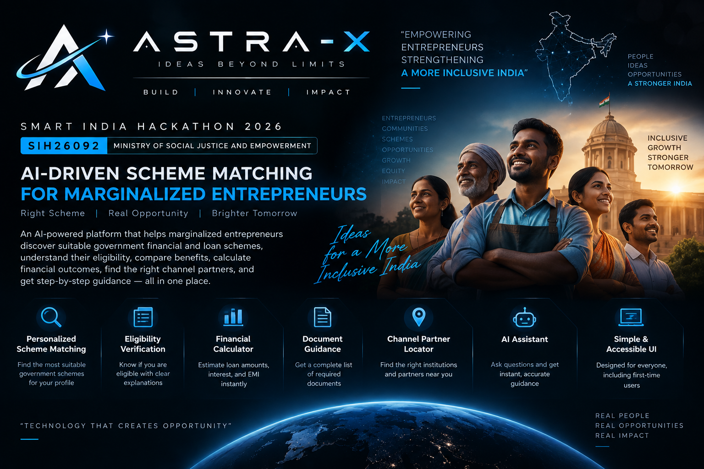

<div align="center">



<br>

# ASTRA-X
### IDEAS BEYOND LIMITS
**BUILD • INNOVATE • IMPACT**

<br>

<a href="https://github.com/ASTRA-X">
  
</a>

<br><br>

<!-- PLACEHOLDER: Replace ASTRA-X with the exact GitHub organization username if different. -->


</div>

<br>

## 📡 ORGANIZATION STATUS

<div align="center">

| TEAM | MISSION | PROBLEM STATEMENT | TEAM SIZE | STATUS |
|:---:|:---:|:---:|:---:|:---:|
| **ASTRA-X** | SIH 2026 | **SIH26092** | 6 Engineers | 🟢 **ACTIVE** |

</div>

<br>

## 🎯 CURRENT MISSION

**SIH26092 — AI-Driven Scheme Matching for Marginalized Entrepreneurs**

Government financial schemes exist — finding the *right* one doesn't. Entrepreneurs can't easily tell what they qualify for, what it's worth, or how to apply. **ASTRA-X is building the AI layer that closes that gap** — from profile to eligibility to a completed application.

<div align="center">

```
   USER PROFILE → ELIGIBILITY → SCHEME MATCHING → RANKING
        → FINANCIAL ANALYSIS → DOCUMENTS → PARTNER DISCOVERY → APPLY
```

</div>

<br>

## 🧠 CORE INTELLIGENCE

<div align="center">

| 🧠 Eligibility | 🔎 Matching | 📊 Ranking | 💬 AI Assistant |
|:---:|:---:|:---:|:---:|
| **📚 RAG / KB** | **💰 Finance** | **📍 Locator** | **📄 Documents** |
| | **💡 Explainability** | | |

</div>

<div align="center">

**Deterministic rules handle eligibility; AI handles matching, ranking, and grounded assistance.**

</div>

<br>

## 🧩 PLATFORM MODULES

| Module | Description |
|---|---|
| 👤 **User Profiling** | Structured capture of entrepreneur data |
| 📚 **Scheme Knowledge Base** | Curated repository of government schemes |
| 🧠 **Eligibility Engine** | Deterministic rule-based qualification |
| 🔎 **AI Matching** | Semantic profile-to-scheme matching |
| 💡 **Explainable Recommendations** | Human-readable reasoning per match |
| 💰 **Financial Calculator** | EMI & repayment estimation |
| 📄 **Document Engine** | Required-document mapping |
| 📍 **Partner Locator** | Eligible channel partner discovery |
| 💬 **AI Assistant** | RAG-grounded guided Q&A |
| 🧭 **Application Guidance** | Step-by-step application walkthrough |
| 🛠️ **Admin Dashboard** | Scheme knowledge base management |
| 📈 **Analytics** | Usage & impact tracking |

<br>

## ⚙️ TECH STACK

<div align="center">


</div>

| Layer | Technology | Status |
|---|---|:---:|
| Frontend | React / Next.js, TypeScript, Tailwind | ⚪ Planned |
| Backend | Python, FastAPI | ⚪ Planned |
| AI / ML | Scikit-learn, NLP, Embeddings, Ranking | ⚪ Planned |
| Deep Learning | PyTorch | 🟡 Under Evaluation |
| AI Assistant | LLM, RAG, Vector DB | 🟡 Under Evaluation |
| Database | PostgreSQL | ⚪ Planned |
| Maps | OpenStreetMap / Leaflet | 🟡 Under Evaluation |
| Infra | Docker, GitHub Actions | ⚪ Planned |

<br>

## 🏗️ ARCHITECTURE

```text
astra-x-sih26092/
├── frontend/
├── backend/
├── ai-engine/
├── data/
├── models/
├── database/
├── docs/
├── tests/
├── deployment/
├── assets/
└── README.md
```

```
Frontend → API Layer → AI / Eligibility Engine → Knowledge Base → Database
```

<br>

## 🗺️ ROADMAP

<div align="center">

```
01 Research → 02 Knowledge Base → 03 Eligibility → 04 AI Matching → 05 Finance
   → 06 Partner Locator → 07 AI Assistant → 08 Integration → 09 Validation → 10 SIH Demo
```

</div>

| Phase | Status |
|---|:---:|
| 01 Research | 🔵 IN PROGRESS |
| 02–10 | ⚪ PLANNED |

<br>

## 👥 TEAM

<!-- PLACEHOLDER: Replace every [Member Name] and USERNAME with real information. Do not leave placeholders in the public README. -->

| Role | Member | GitHub |
|---|---|---|
| 👨‍💻 Frontend Engineer | `[Member Name]` | [github.com/USERNAME](https://github.com/USERNAME) |
| ⚙️ Backend Engineer | `[Member Name]` | [github.com/USERNAME](https://github.com/USERNAME) |
| 🧠 AI/ML Engineer | `[Member Name]` | [github.com/USERNAME](https://github.com/USERNAME) |
| 📊 Research & Data Engineer | `[Member Name]` | [github.com/USERNAME](https://github.com/USERNAME) |
| 🎨 UI/UX Designer | `[Member Name]` | [github.com/USERNAME](https://github.com/USERNAME) |
| 📋 Product / Documentation Lead | `[Member Name]` | [github.com/USERNAME](https://github.com/USERNAME) |

<br>

## 🧭 ENGINEERING PRINCIPLES

<div align="center">

`Evidence First` `Explainable AI` `Privacy Aware` `Reliable Rules`
`Modular Architecture` `API First` `Test Before Deploy` `User Centric`

</div>

<br>

## 🔐 RESPONSIBLE AI

- Recommendations grounded in verified scheme data
- Eligibility governed by deterministic rules, not model inference
- Every recommendation is explainable
- Minimal user data collection
- Human verification advised for critical financial decisions

<br>

## 🎬 DEMO FLOW

<div align="center">

```
PROFILE → MATCH → VERIFY → COMPARE → CALCULATE → DOCUMENTS → LOCATE → APPLY
```

</div>

[](#)
<!-- PLACEHOLDER: Replace # with the actual video URL once uploaded. -->

<br>

## 🔗 EXPLORE ASTRA-X

<!-- PLACEHOLDER: Replace SIH26092 with <ACTUAL_REPOSITORY_NAME> if the repository is named differently. Do not invent an alternative name. -->

| Resource | Link |
|---|---|
| Organization | [ASTRA-X](https://github.com/ASTRA-X) |
| SIH 2026 Project | [SIH26092](https://github.com/ASTRA-X/SIH26092) |
| Documentation | [Docs](https://github.com/ASTRA-X/SIH26092/tree/main/docs) |
| Issues | [Issues](https://github.com/ASTRA-X/SIH26092/issues) |
| Discussions | [Discussions](https://github.com/ASTRA-X/SIH26092/discussions) |
| Project Board | [Board](https://github.com/ASTRA-X/SIH26092/projects) |

<div align="center">

<a href="https://github.com/ASTRA-X"></a>
<a href="YOUR_LINKEDIN_URL"></a>
<a href="mailto:YOUR_EMAIL@example.com"></a>

</div>

<!-- PLACEHOLDER: Replace YOUR_LINKEDIN_URL and YOUR_EMAIL@example.com with verified contact details, or remove the badges if none exist. -->

<br>

---

<div align="center">

## ASTRA-X
**IDEAS BEYOND LIMITS**
BUILD • INNOVATE • IMPACT
SMART INDIA HACKATHON 2026

*Engineering intelligence for real-world impact.*

</div>

<!--
ASTRA-X FINAL SETUP CHECKLIST

[ ] Replace GitHub organization username if required
[ ] Add ../assets/astra-x-sih26092.png banner image
[ ] Create SIH26092 repository
[ ] Replace repository name if different
[ ] Add all 6 team member GitHub usernames
[ ] Add official contact email
[ ] Add LinkedIn if available
[ ] Add actual deployment URL
[ ] Add demo video URL
[ ] Create GitHub Project board
[ ] Enable Issues / Discussions
[ ] Add LICENSE and CONTRIBUTING.md
[ ] Add architecture / AI / dataset documentation
[ ] Verify every external link
[ ] Remove all placeholder URLs before making the README public
-->
